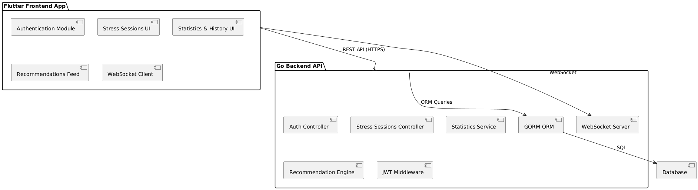
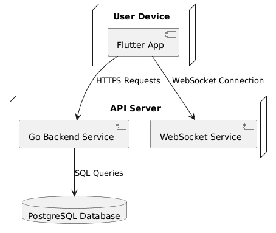
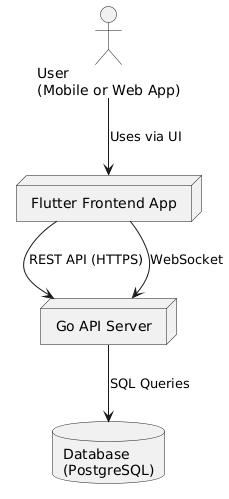

# Stress-management-app
Stress Management App is a modern platform that empowers users to track their stress levels, plan relaxation activities, and monitor progress over time.
Users will be able to create detailed records of stressful events, receive personalized recommendations, and view insightful statistics about their wellbeing.

## Vision
Stress Management App aims to deliver an intuitive and supportive environment to help users understand their stress patterns and take actionable steps toward improved wellbeing.
Through structured tracking, personalized recommendations, and clear insights, users can gain confidence in managing their stress effectively.


## Core features
- [X] Creation and Viewing of Stress Sessions
- Users can create entries documenting stressful experiences, including description, stress level, and date.

- [X] Relaxation Recommendations
- The app provides relaxation suggestions, such as breathing exercises or mindfulness practices.
These may be displayed as a feed on the main screen.

- [X] Stress History and Statistics
- Users can access historical data and visualize trends, such as average stress levels over time and improvements.

## Architecture Overview

All application features will be built around a single core service:

### Backend
- [X] User Registration and Authentication
- Account creation and login functionality
- JWT-based authentication for secure access

- [X] User Data Storage
- Persistent storage of user profiles

- [X] Stress Session Management
- Full CRUD operations for stress session entries

- [X] Recommendation Engine
- Delivery of relevant relaxation and wellness recommendations

- [X] Real-Time Updates

- WebSocket channels to broadcast updates (e.g., new recommendations or session changes)

- [X] History and Statistics

- Aggregation and retrieval of user stress history and analytics

### Frontend screens
- [X] Registration & Login
- User account creation and authentication
- [X] Add Stress Session
- Form for creating new stress session records
- [X] Stress History
- List and timeline view of past stress entries
- [X] Recommendations
- Feed of relaxation activities and wellness tips
- [X] User Profile
- Display and management of personal account settings

## Technical stack
The project leverages a modern and robust technology stack to ensure performance, maintainability, and a seamless user experience:
### Backend:

- [X] Go (Golang):
- High-performance language powering all backend APIs and business logic.

- [x] GORM:
- ORM library for database migrations and data access.

### Frontend:

- [X] Flutter:
- Cross-platform framework for building a responsive and smooth mobile and web user interface.

- [X] Authentication:
- JWT (JSON Web Tokens)

- [X] Real-Time Communication:
- WebSockets: enables live updates and notifications to clients.

### Component diagram 

This diagram shows internal components and how they interact:
- [X] Frontend Modules:
- Authentication Module: Registration and login forms
- Stress Sessions UI: Creating and viewing stress entries
- Statistics & History UI: Visualizing past stress levels
- Recommendations Feed: Displaying relaxation suggestions
- WebSocket Client: Receiving live updates

- [X] Backend Components:
- Auth Controller: Handles registration and login
- JWT Middleware: Validates tokens for secured endpoints
- Stress Sessions Controller: CRUD operations for stress entries
- Statistics Service: Computes aggregates over stress data
- Recommendation Engine: Generates relaxation recommendations
- WebSocket Server: Pushes notifications to clients
- GORM ORM: Data access layer to the database

[component_diagram.puml](./docs/architecture/component_diagram.puml)

### Deployment diagram

This diagram shows the runtime deployment:

- [X] The User Device runs the Flutter app (web or mobile).
- [X] The API Server hosts:
- The REST API
- The WebSocket server
- [X] The PostgreSQL Database stores all persistent data.
- [X] The API Server communicates securely with clients and the database.

### Context diagram


This diagram shows the high-level context of the system:

- User interacts with the application through a Flutter-based mobile or web client.
- The Flutter Frontend communicates with the Go API Server over secure HTTPS for REST API calls and WebSocket connections for real-time updates.
- The Go API Server uses a relational Database (e.g., PostgreSQL) for storing user accounts, stress sessions, and statistics.

[diagram](./docs/architecture/context_diagram.puml)


## API Documentation

The Stress Management App provides a RESTful API secured with JWT authentication.  
Below you’ll find an overview of the available endpoints.  
For complete details and request/response examples, see the Swagger UI.

---

### Authentication

| Method | Endpoint    | Description              |
|--------|-------------|--------------------------|
| POST   | `/login`    | Log in an existing user  |
| POST   | `/register` | Register a new user      |

---

### Recommendations

| Method | Endpoint                  | Description                           |
|--------|---------------------------|---------------------------------------|
| GET    | `/recommendations`        | Get all recommendations               |
| POST   | `/recommendations`        | Create a new recommendation           |
| GET    | `/recommendations/{id}`   | Get a recommendation by ID            |
| PUT    | `/recommendations/{id}`   | Update a recommendation by ID         |

---

### Stress Sessions

| Method | Endpoint            | Description                                           |
|--------|---------------------|-------------------------------------------------------|
| GET    | `/sessions`         | Get all stress sessions for the authenticated user    |
| POST   | `/sessions`         | Create a new stress session and broadcast via WebSocket |
| GET    | `/sessions/{id}`    | Get a stress session by ID                            |
| DELETE | `/sessions/{id}`    | Delete a stress session                               |

---

### Statistics

| Method | Endpoint | Description                      |
|--------|----------|----------------------------------|
| GET    | `/stats` | Get aggregated user statistics  |

---

### WebSocket

| Method | Endpoint | Description                                      |
|--------|----------|--------------------------------------------------|
| GET    | `/ws`    | WebSocket endpoint for real-time session updates |

---

### Data Models (Examples)

**CreateSessionInput**
```json
{
  "date": "2025-07-12",
  "description": "Felt stressed due to workload",
  "stress_level": 7
}
```

**LoginInput**
```json
{
  "email": "user@example.com",
  "password": "password123"
}
```

**RegisterInput**
```json
{
  "email": "user@example.com",
  "nickname": "JohnDoe",
  "password": "password123"
}
```

**Recommendation input**
```json
{
  "title": "Deep Breathing Exercise",
  "description": "A guided breathing session to help you relax."
}
```

### Authentication & Security
All endpoints (except /login and /register) require a valid JWT token in the Authorization header:

```makefile
Authorization: Bearer <your_token_here>
```
Tokens are issued upon successful login and must be included in every authenticated reques

### Swagger UI
The complete interactive API documentation is available [here](https://github.com/slickip/Stress-management-app/blob/main/backend/docs/swagger.json)